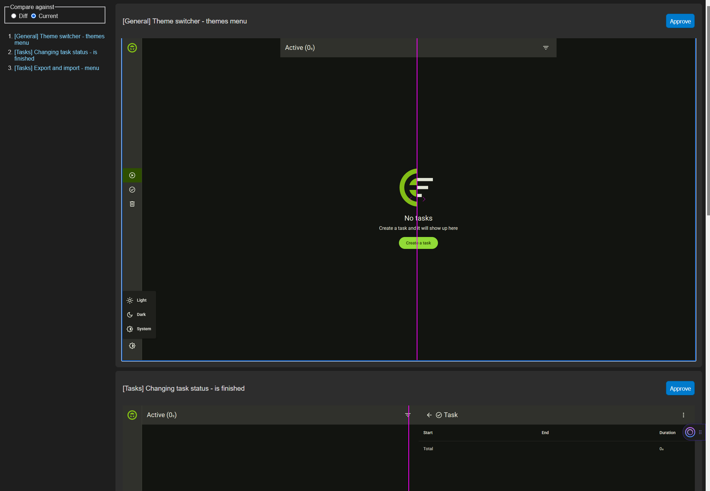

# Visual regression review

A tool to review visual regression screenshots. Not very polished and has bugs.



Installation:

```
git clone https://github.com/Klaster1/visual-regression-review.git
cd visual-regression-review
npm i
```

```
npm i -g https://github.com/Klaster1/visual-regression-review
```

Usage:

1. Start VRR: `node /path/to/visual-regression-review/src/index.ts --path="c:\dev\my-projects\visual-regression`.
2. Go to the address from the output.
3. Review screenshots by inspecting the reference images, current images and diffs. It's up to you to generate those.
4. Press "Approve" to replace reference image with current image. This also removes the diff.

Prerequisites:

1. Node.js with unflagged "--experimental-strip-types" to run TypeScript natively (23.6.0 and newer).
2. Files at the path need to follow this pattern: `*.{reference|current|diff}.png`.
